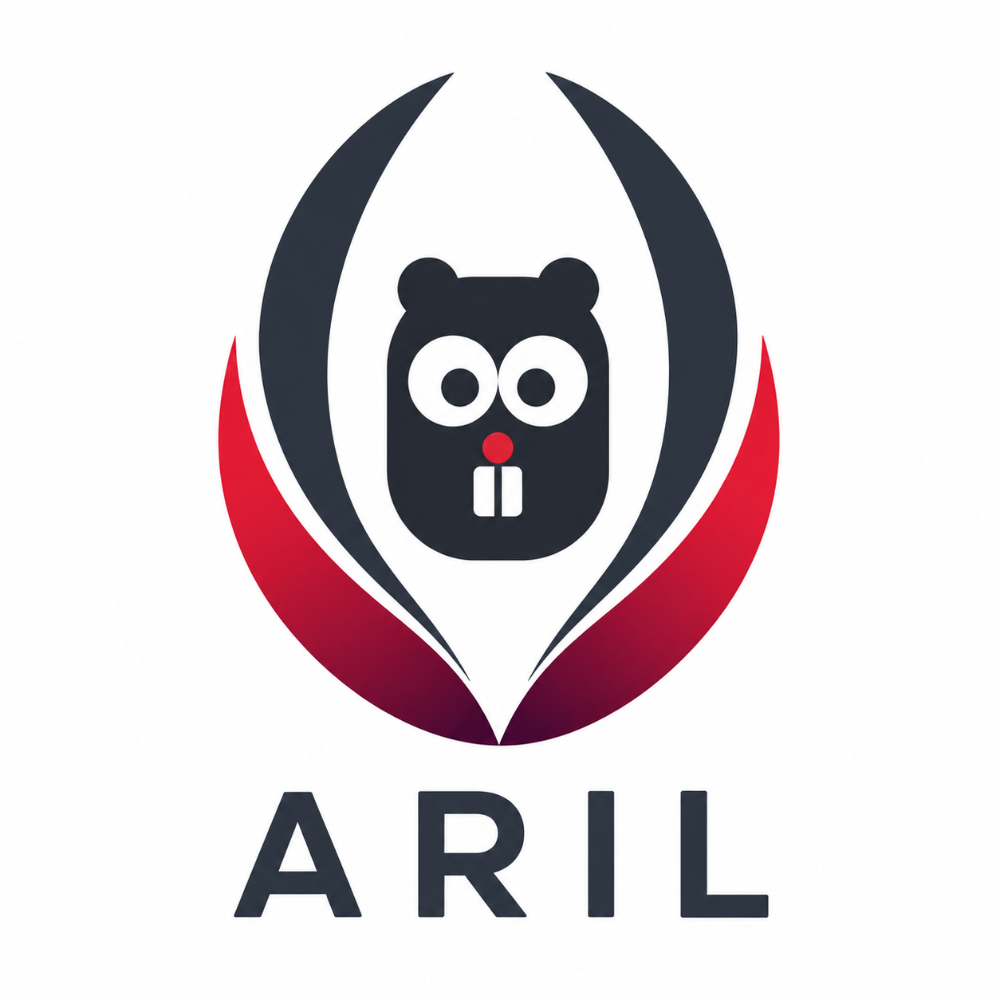

# Aril

<p align="center"></p>

**A reliable, intuitive language with TypeScript-style syntax, compiled to Go.**

## The idea

Aril is a reliable, modern programming language with TypeScript-like ergonomics
and Go-class deployment characteristics. It pairs that familiar syntax with
algebraic data types, exhaustive pattern matching, and explicit
`Result`/`Option`-based error handling — so whole classes of bugs surface at
compile time, not in production.

Under the hood, Aril compiles to Go and inherits its strengths: static
binaries, goroutine concurrency, fast startup, and the standard library. The Go
core is the engine, not a leaky surface — Aril keeps the runtime developers love
and drops the friction (`if err != nil`, `nil` footguns) behind `Result` /
`Option` and a single `try` keyword.

Aril is a language in its own right, not a TypeScript-to-Go transpiler: no
JavaScript semantics, no npm, no browser target — and that is deliberate.

> Status: **pre-alpha** — the compiler builds a growing corpus of examples
> end-to-end, but the language and tooling are still moving fast.

## A taste

```aril
import http
import io
import json

type User = {
  id:   string
  name: string
}

func getUser(id: string): Result<User, error> {
  let resp = try http.get("https://api.example.com/users/" + id)
  let body = try io.readAll(resp.body)
  let user = try json.parse<User>(body)
  return Ok(user)
}
```

## Building the compiler

The Aril compiler is itself written in Go.

```sh
go build ./cmd/aril
./aril version
```

Source files use the `.aril` extension.

## Read more

| To understand... | Read |
|---|---|
| The architectural commitments and why Aril is the way it is | [`docs/design-decisions.md`](docs/design-decisions.md) |
| How the compiler is built — pipeline, bindings, concurrency, testing | [`docs/architecture.md`](docs/architecture.md) |
| The language surface (working draft) | [`docs/language-spec.md`](docs/language-spec.md) |
| Target spelling of every stdlib call used by the suite | [`docs/binding-surface.md`](docs/binding-surface.md) |
| What v1 must be able to do — the acceptance suite | [`examples/README.md`](examples/README.md) |

## License

The Aril compiler is licensed under the [Apache License 2.0](LICENSE) (patent
grant included). The runtime support code Aril emits into the programs it
compiles is licensed under the [BSD Zero Clause License (0BSD)](LICENSE.runtime),
so programs you build with Aril carry no Aril attribution obligation — the same
split TypeScript uses (Apache-2.0 compiler, 0BSD `tslib` helpers).
